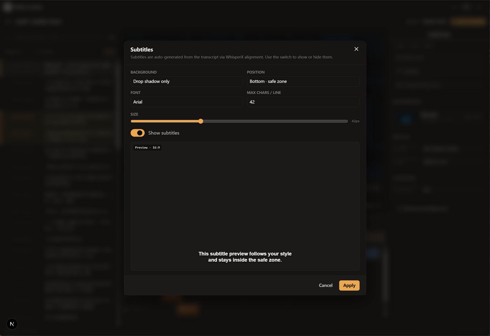
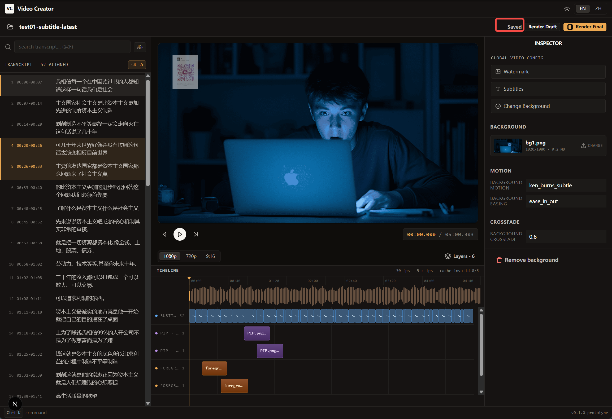
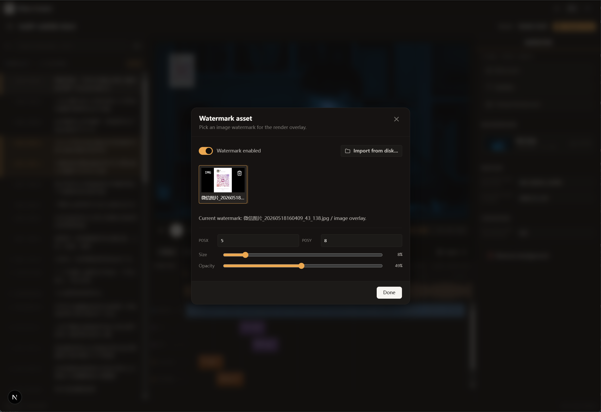
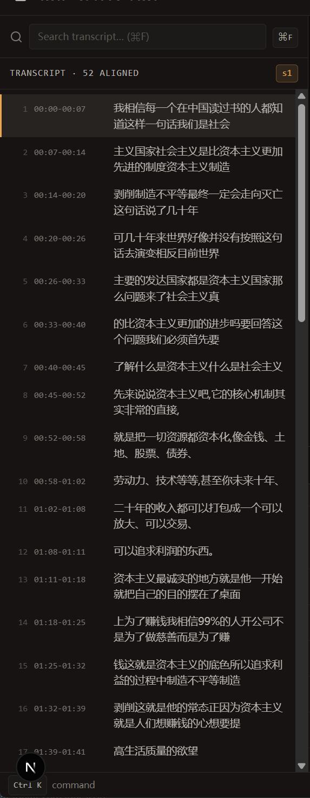

the prototype page is in the `../v1`

1.  subtitle modal, replace the `Max chars / line` with `Color`, it uses to set the color of subtitle. 'Background' field doesn't have the ability to set background color, opacity and radius of the background rectangle. 
2. Editor interface removes the Save button, only shows saved, saving and empty text when initiated. The automated save function runs in the back stage. Once the config of the video changes, the program save it asynchrously. referencing 
3. add entries to set position, opacity and Size threshold of watermark on video. references 
4.  transcript sentences add an icon at right place  to enable the sentence editing, because sometime I would find some typos in the sentences. Another thing I want to mention is when the sentence get into the editing mode, keep the height of the sentence element fixed, don't make the web re-layout.
5. background of video should support the mixture form including images and video footage, which is not supported before. you help me brainstorm how to realize it, because with videos, they have durations, but images, they don't, so how long an image would cover the range of time in the video would be the key

